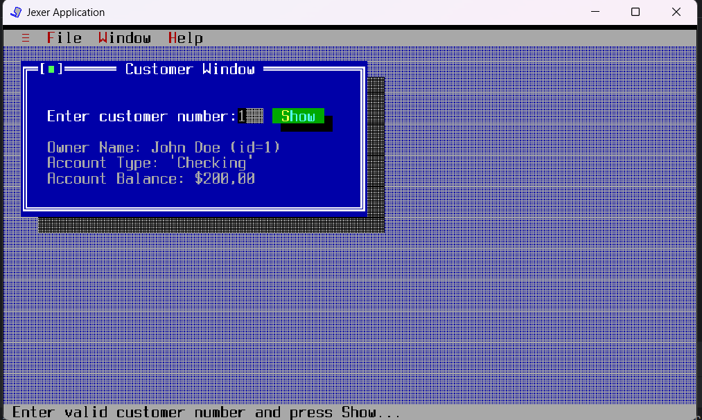
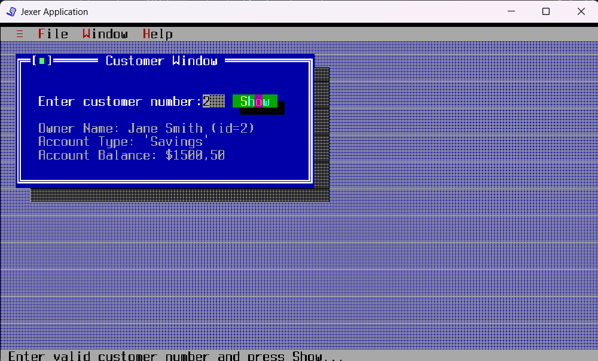

### Практичнна робота - Робота з консоллю - TUI

### Хід роботи

* Тепер при різних номерах клієнтів
ми бачими різних людей і їх рахунки

Змінений клас TUIdemo:
```java
package domain;

import jexer.TAction;
import jexer.TApplication;
import jexer.TField;
import jexer.TText;
import jexer.TWindow;
import jexer.event.TMenuEvent;
import jexer.menu.TMenu;

/**
 *
 * @author Alexander 'Taurus' Babich
 */
public class TUIdemo extends TApplication {

    private static final int ABOUT_APP = 2000;
    private static final int CUST_INFO = 2010;
    private Customer[] customers;

    public static void main(String[] args) throws Exception {
        TUIdemo tdemo = new TUIdemo();
        (new Thread(tdemo)).start();
    }

    public TUIdemo() throws Exception {
        super(BackendType.SWING);

        // Initialize customers
        customers = new Customer[]{
                new Customer(1, "John Doe", "Checking", 200.00),
                new Customer(2, "Jane Smith", "Savings", 1500.50),
                new Customer(3, "Bob Johnson", "Checking", 50.75)
                // Add more customers as needed
        };

        addToolMenu();
        //custom 'File' menu
        TMenu fileMenu = addMenu("&File");
        fileMenu.addItem(CUST_INFO, "&Customer Info");
        fileMenu.addDefaultItem(TMenu.MID_SHELL);
        fileMenu.addSeparator();
        fileMenu.addDefaultItem(TMenu.MID_EXIT);
        //end of 'File' menu

        addWindowMenu();

        //custom 'Help' menu
        TMenu helpMenu = addMenu("&Help");
        helpMenu.addItem(ABOUT_APP, "&About...");
        //end of 'Help' menu

        setFocusFollowsMouse(true);
        //Customer window
        ShowCustomerDetails();
    }

    @Override
    protected boolean onMenu(TMenuEvent menu) {
        if (menu.getId() == ABOUT_APP) {
            messageBox("About", "\t\t\t\t\t   Just a simple Jexer demo.\n\nCopyright \u00A9 2019 Alexander \'Taurus\' Babich").show();
            return true;
        }
        if (menu.getId() == CUST_INFO) {
            ShowCustomerDetails();
            return true;
        }
        return super.onMenu(menu);
    }

    private void ShowCustomerDetails() {
        TWindow custWin = addWindow("Customer Window", 2, 1, 40, 10, TWindow.NOZOOMBOX);
        custWin.newStatusBar("Enter valid customer number and press Show...");

        custWin.addLabel("Enter customer number: ", 2, 2);
        TField custNo = custWin.addField(24, 2, 3, false);
        TText details = custWin.addText("Owner Name: \nAccount Type: \nAccount Balance: ", 2, 4, 38, 8);
        custWin.addButton("&Show", 28, 2, new TAction() {
            @Override
            public void DO() {
                try {
                    int custNum = Integer.parseInt(custNo.getText());
                    Customer customer = findCustomerById(custNum);
                    if (customer != null) {
                        details.setText(String.format("Owner Name: %s (id=%d)\nAccount Type: '%s'\nAccount Balance: $%.2f",
                                customer.getName(), customer.getId(), customer.getAccountType(), customer.getAccountBalance()));
                    } else {
                        messageBox("Error", "Customer not found!").show();
                    }
                } catch (Exception e) {
                    messageBox("Error", "You must provide a valid customer number!").show();
                }
            }
        });
    }

    private Customer findCustomerById(int id) {
        for (Customer customer : customers) {
            if (customer.getId() == id) {
                return customer;
            }
        }
        return null;
    }
}
```

Клас Customer:
```java
package domain;

public class Customer {
    private int id;
    private String name;
    private String accountType;
    private double accountBalance;

    public Customer(int id, String name, String accountType, double accountBalance) {
        this.id = id;
        this.name = name;
        this.accountType = accountType;
        this.accountBalance = accountBalance;
    }

    public int getId() {
        return id;
    }

    public String getName() {
        return name;
    }

    public String getAccountType() {
        return accountType;
    }

    public double getAccountBalance() {
        return accountBalance;
    }
}
```
### Приклад роботи програми:



